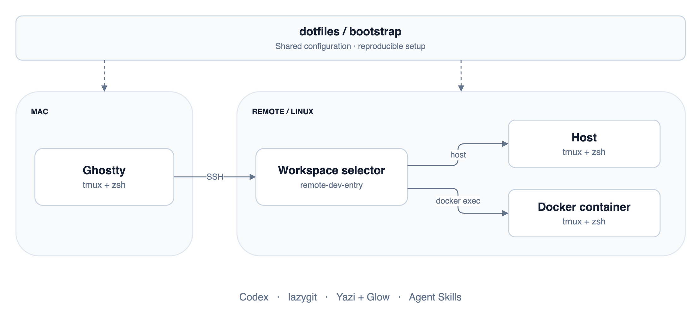

<p align="center">
  
</p>

<h1 align="center">dotfiles</h1>

<p align="center">从 Mac 到服务器与容器，保持熟悉的终端开发体验。</p>

<p align="center">
  
  
  
  
</p>

<p align="center">
  <a href="#快速开始"><strong>快速开始</strong></a> ·
  <a href="#日常使用">日常使用</a> ·
  <a href="#配置与维护">配置与维护</a>
</p>



<p align="center"><sub>宿主机与容器各自运行 tmux，连接时选择其一。<a href="terminal-tmux/assets/terminal-workflow.drawio">查看图源 ↗</a></sub></p>

## 核心体验

- **一套环境** — 统一 Ghostty、tmux、zsh 和日常开发工具。
- **直接进入工作区** — 选择 SSH 主机与容器，重连继续已有会话。
- **随处使用 Agent** — 同步 Agent Skills，更新 Codex CLI，查看任务状态。

## 快速开始

```sh
git clone https://github.com/Crucifixion-Fxl/dotfiles ~/.dotfiles
bash ~/.dotfiles/terminal-tmux/bootstrap.sh
exec zsh -l
```

<sub>macOS 需先安装 Homebrew；Debian / Ubuntu 需 root 或 sudo 权限。服务器与容器内使用同一套命令，以实际开发用户运行。</sub>

<details>
<summary><strong>更新已有环境</strong></summary>

```sh
git -C ~/.dotfiles pull --ff-only && \
  bash ~/.dotfiles/terminal-tmux/bootstrap.sh
exec zsh -l
```

容器建议持久化开发用户的 HOME。Mac 字体由安装器配置，Linux GUI 终端字体需自行设置。

</details>

## 日常使用

**进入工作区**

```sh
ghostty-dev                 # 新建标签页，选择 SSH 主机
ghostty-dev dev-4090        # 直连 ~/.ssh/config 中的主机别名
connect-remote-dev HOST     # 从当前终端连接
```

连接后选择宿主机或容器，进入对应的 `dev` tmux 会话。容器需先完成安装。

**tmux 快捷键**

先按 <kbd>Ctrl</kbd> + <kbd>B</kbd>，再按下表中的键。

| 按键 | 操作 | 按键 | 操作 |
| :---: | --- | :---: | --- |
| <kbd>c</kbd> | 新建窗口 | <kbd>s</kbd> | 会话与 Codex 状态 |
| <kbd>t</kbd> | Shell 浮窗 | <kbd>d</kbd> | 离开会话，保留进程 |
| <kbd>g</kbd> | lazygit 浮窗 | <kbd>G</kbd> | lazygit 新窗口 |
| <kbd>&lt;</kbd> | 窗口前移 | <kbd>&gt;</kbd> | 窗口后移 |
| <kbd>S</kbd> | 保存会话布局 | <kbd>R</kbd> | 恢复会话布局 |

<details>
<summary>输入法与会话保存</summary>

状态栏显示 `[Ctrl-b]` 表示前缀已收到，`c`、`s` 也兼容持续按住 Ctrl。
Mac 启用 Karabiner 规则后，Ghostty 中按 Ctrl+B 临时切到英文，完成 `c` / `s` 后恢复原输入法。
会话每 15 分钟自动保存，恢复由手动触发。

</details>

<details>
<summary>随手可用的工具</summary>

| 命令 | 用途 |
| --- | --- |
| `codex` | 在当前仓库运行编码 Agent |
| `lazygit` / `glab` | Git 工作流 / GitLab CLI |
| `y` | Yazi 文件浏览，退出后进入选中的目录 |
| `glow README.md` | Markdown 阅读；Yazi 预览也使用 Glow |
| `vim` / `fresh` | 文本编辑 |
| `btop` | 系统资源监控 |

</details>

## 配置与维护

[tmux](terminal-tmux/tmux/tmux.conf) · [zsh](terminal-tmux/shell/zshrc) · [Ghostty](terminal-tmux/ghostty/config.ghostty) · [Yazi](terminal-tmux/yazi/yazi.toml) · [lazygit](terminal-tmux/lazygit/config.yml) · [Agent Skills](agent-skills/sources)

<details>
<summary>环境检查与 Skills 更新</summary>

```sh
# 检查当前安装
bash ~/.dotfiles/terminal-tmux/bootstrap.sh --check

# 仅更新 Agent Skills
bash ~/.dotfiles/terminal-tmux/bootstrap.sh --skills-only
```

Skills 同步至 `~/.agents/skills`，更新后开启新的 Agent 会话。
Codex CLI 在每次完整更新时跟随最新版。

[安装脚本](terminal-tmux/bootstrap.sh) · [版本锁定](terminal-tmux/versions.lock) · [回归检查](terminal-tmux/tests)

</details>

<sub>机器专属配置放在 <code>~/.zshrc.local</code>。密钥、Token、Git 身份与会话数据留在各机器。</sub>
